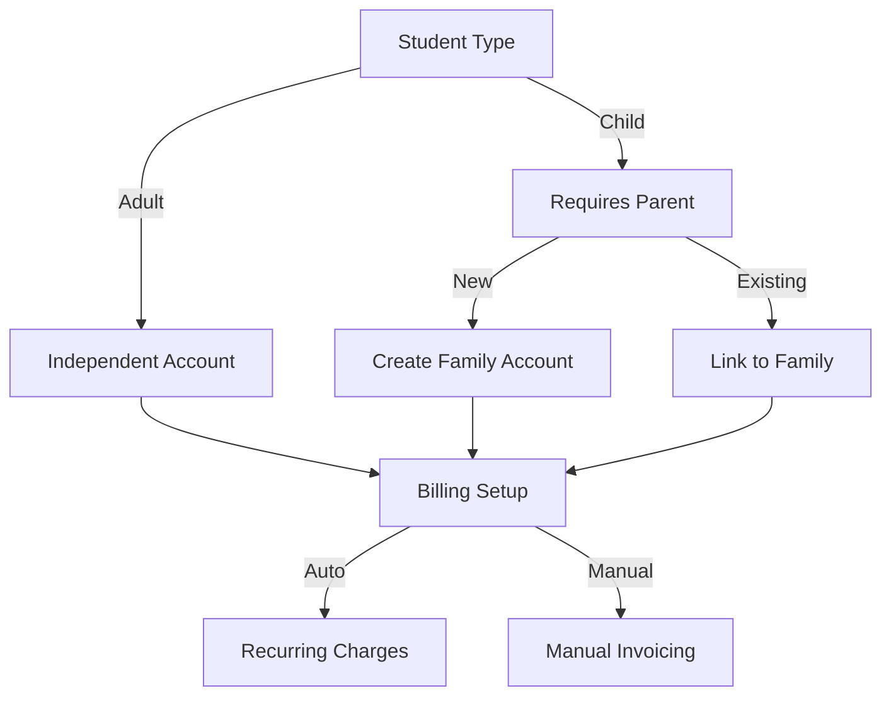

# Enterprise Automation QA Challenge - Music School Management System

## 🎯 Challenge Overview

Welcome to the PearlThoughts Enterprise QA Challenge. This is not your typical "test a form" exercise—you'll be testing a complex, production-grade music school management system with real business implications.

**Platform**: MyMusicStaff (https://app.mymusicstaff.com)
**Focus**: Student Onboarding - A business-critical workflow
**Complexity**: Enterprise-level with multiple system integrations
**Time Estimate**: 4-6 hours
**Deadline**: 5 business days from receipt

## 🏢 Why This Challenge Matters

We're looking for QA engineers who can:
- **Think like a business owner**: Understand revenue and compliance implications
- **Think like an architect**: Consider system design and integration points
- **Think like a user**: Empathize with parents, students, and administrators
- **Execute like a professional**: Write maintainable, reliable test automation

This challenge simulates real enterprise testing challenges you'll face in our production environment.

## 📚 Essential Reading

Before you begin coding, invest time understanding the system:

1. **[Platform Overview](docs/PLATFORM_OVERVIEW.md)** - Why music school management is complex
2. **[Student Onboarding Flow](docs/STUDENT_ONBOARDING_FLOW.md)** - Detailed workflow analysis
3. **[Enterprise Patterns](docs/ENTERPRISE_PATTERNS.md)** - Architectural testing considerations
4. **[Requirements](docs/REQUIREMENTS.md)** - Specific test scenarios to implement
5. **[Submission](docs/SUBMISSION.md)** - How to submit your solution

## 🎼 The Business Context

### The Industry Challenge

Music schools aren't just scheduling apps—they're complex businesses managing:
- **$50K-500K monthly revenue** through tuition
- **50-500 students** with unique needs
- **10-50 teachers** with varying availability
- **Compliance requirements** (COPPA, FERPA, PCI)
- **Multi-stakeholder relationships** (parents, students, teachers)

### Why Student Onboarding?

Student onboarding is the **most critical workflow** because:
- 🏆 **Conversion Point**: Where prospects become paying customers
- 💰 **Revenue Impact**: Directly affects Monthly Recurring Revenue
- ⚖️ **Compliance Critical**: COPPA requirements for minors
- 🔄 **Data Source**: Errors cascade through entire system
- 📊 **Performance Indicator**: Onboarding friction = lost revenue

## 🔍 What Makes This Complex?

### Business Logic Complexity



### State Management Complexity

Students transition through multiple states, each with business implications:

```
Lead → Trial → Active → Paused → Inactive
       ↓        ↓         ↓
    Waiting  Graduated  Dropped
```

### Integration Complexity

The student service integrates with:
- **Stripe** for payment processing
- **SendGrid** for email notifications
- **Twilio** for SMS alerts
- **Google Calendar** for scheduling
- **Zoom** for online lessons

## 🚀 Getting Started

### Step 1: Access MyMusicStaff

1. Go to https://www.mymusicstaff.com
2. Click "Start Free Trial" (30 days free)
3. Set up your test school
4. Familiarize yourself with the platform

### Step 2: Setup Your Environment

```bash
# Clone this repository (fork it privately first)
git clone [your-fork-url]
cd automation-qa-challenge

# Install dependencies
npm install

# Copy environment configuration
cp .env.example .env

# Edit .env with your test account credentials
# MMS_EMAIL=your-trial-email@example.com
# MMS_PASSWORD=your-trial-password
# MMS_SCHOOL_URL=https://your-school.mymusicstaff.com
```

### Step 3: Understand the Scope

You're testing the **Student Onboarding Flow**:

| Page | URL Path | Key Features |
|------|----------|--------------|
| Add Student | `/Teacher/v2/en/students/add` | Multi-step form, validation, conditional logic |
| Student List | `/Teacher/v2/en/students` | Search, filters, bulk operations |
| Student Details | `/Teacher/v2/en/students/details?id={id}` | 7 tabs, edit capabilities, family linkage |

## 📋 Your Mission

### Required Test Coverage

#### 1. Form Validation (Critical)
- [ ] Required field validation
- [ ] Email format validation
- [ ] Phone number validation
- [ ] SMS capability conditional logic
- [ ] Child requires parent validation

#### 2. Successful Creation Flows (Critical)
- [ ] Adult student with minimal data
- [ ] Adult student with complete profile
- [ ] Child student with new family
- [ ] Child student linking to existing family

#### 3. Data Persistence (Critical)
- [ ] Student appears in listing immediately
- [ ] All data saved correctly
- [ ] Student details page shows accurate data
- [ ] Data persists across sessions

#### 4. Business Rules (Important)
- [ ] Status implications (Active vs Trial vs Waiting)
- [ ] Family account creation and linking
- [ ] Default settings application
- [ ] Billing setup flow

#### 5. Edge Cases (Choose 3+)
- [ ] Duplicate email handling
- [ ] Special characters in names (O'Brien, José, 李明)
- [ ] International phone numbers
- [ ] Timezone considerations
- [ ] Concurrent user creation
- [ ] Status transitions
- [ ] Maximum field lengths
- [ ] Session timeout handling

### Test Implementation Requirements

Your solution must demonstrate:

1. **Page Object Model** - Clean abstraction of UI elements
2. **Test Data Management** - Dynamic generation, proper cleanup
3. **Async Handling** - No hard-coded waits, proper promises
4. **Error Handling** - Graceful failure, meaningful messages
5. **Business Focus** - Test business logic, not UI details

## 🏗️ Expected Project Structure

```
automation-qa-challenge/
├── tests/
│   ├── e2e/
│   │   ├── student-onboarding.spec.ts    # Main test suite
│   │   └── edge-cases.spec.ts           # Edge case coverage
│   └── fixtures/
│       ├── pages/
│       │   ├── BasePage.ts              # Base page class
│       │   ├── StudentFormPage.ts       # Add student page
│       │   ├── StudentListPage.ts       # Student listing
│       │   └── StudentDetailsPage.ts    # Student details
│       ├── data/
│       │   ├── StudentFactory.ts        # Test data generation
│       │   └── TestDataCleaner.ts       # Cleanup utilities
│       └── helpers/
│           ├── WaitHelpers.ts           # Smart wait utilities
│           └── ValidationHelpers.ts     # Common validations
├── reports/                              # Test execution reports
├── docs/                                 # Platform documentation
├── .env                                  # Your credentials (don't commit!)
├── .env.example                         # Template for others
├── playwright.config.ts                 # Playwright configuration
├── package.json                         # Dependencies
├── tsconfig.json                        # TypeScript configuration
├── README.md                            # This file
└── SOLUTION.md                          # Your implementation notes
```

## 💡 Pro Tips for Success

### Do's ✅
- **Read all documentation first** - Understanding > Coding
- **Test business value** - Revenue, compliance, efficiency
- **Think about scale** - Will it work with 1000 students?
- **Consider failure modes** - What happens when services fail?
- **Document assumptions** - We want to understand your thinking
- **Clean up test data** - Leave no trace

### Don'ts ❌
- **Don't test CSS** - Colors, fonts, spacing don't matter
- **Don't over-engineer** - Balance complexity with maintainability
- **Don't ignore edge cases** - Real users do unexpected things
- **Don't hardcode waits** - Use Playwright's smart waiting
- **Don't skip documentation** - We need to understand your approach

## 🤖 AI Usage Guidelines

You may use AI tools (ChatGPT, Copilot, etc.) to assist you, but:
- You must understand every line of code
- Add comments for AI-assisted sections: `// AI-assisted: [what it helped with]`
- The overall architecture must be your design
- You'll explain your code in the interview

## 📊 How We'll Evaluate You

| Criteria | Weight | What We're Looking For |
|----------|--------|------------------------|
| **Business Understanding** | 30% | Do you test what matters to the business? |
| **Test Coverage** | 25% | Did you cover critical paths and edge cases? |
| **Code Quality** | 20% | Is your code maintainable and well-structured? |
| **Technical Implementation** | 15% | Proper use of Playwright, TypeScript, patterns |
| **Documentation** | 10% | Can others understand your approach? |

### What Impresses Us

- 🎯 **Risk-based testing** - Focus on high-impact scenarios
- 🔄 **State machine thinking** - Understanding status transitions
- 🏗️ **Architectural awareness** - Considering system integrations
- 📈 **Performance consciousness** - Efficient test execution
- 🛡️ **Security mindset** - Input validation, data protection

## 🚨 Common Pitfalls to Avoid

1. **Testing the wrong things** - UI details instead of business logic
2. **Flaky tests** - Inconsistent results due to poor waiting strategies
3. **No cleanup** - Leaving test data that affects next run
4. **Over-complexity** - Making tests harder to maintain than the app
5. **Under-documentation** - Not explaining your approach

## 📤 Submission

Follow the detailed instructions in [SUBMISSION.md](docs/SUBMISSION.md).

Quick checklist:
- [ ] All required scenarios implemented
- [ ] Tests pass consistently
- [ ] Code follows TypeScript best practices
- [ ] SOLUTION.md explains your approach
- [ ] Test data cleanup implemented
- [ ] Repository shared with reviewers

## ❓ Questions?

- **Technical questions**: Create an issue in your fork
- **Platform access issues**: Email immediately (we'll provide alternatives)
- **Clarifications**: Document assumptions and proceed

## 🎓 What Success Looks Like

A successful submission will:
1. Demonstrate deep understanding of business requirements
2. Show thoughtful test design and prioritization
3. Implement reliable, maintainable automation
4. Handle edge cases gracefully
5. Provide clear documentation of approach and trade-offs

## 🔥 Final Thoughts

This challenge represents real complexity you'll face in enterprise software testing. We're not looking for perfection—we're looking for thoughtful problem-solving, business acumen, and technical competence.

Remember: **You're not just testing forms, you're validating a business.**

Good luck! We look forward to seeing how you approach this complex, real-world testing challenge.

---

**Note**: This challenge is for evaluation purposes only. Please don't share the challenge or your solution publicly.