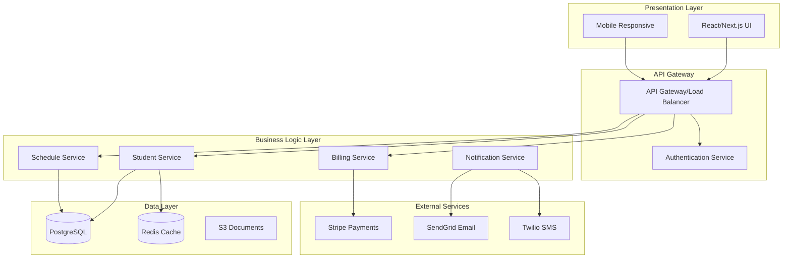
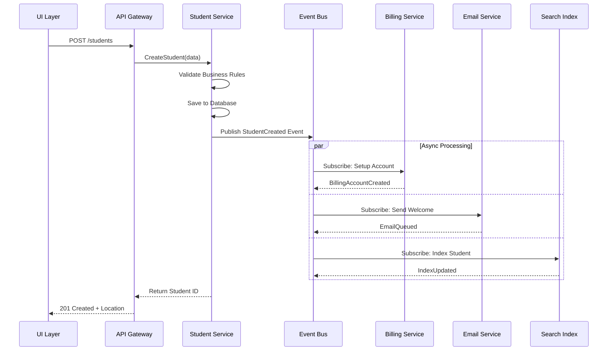
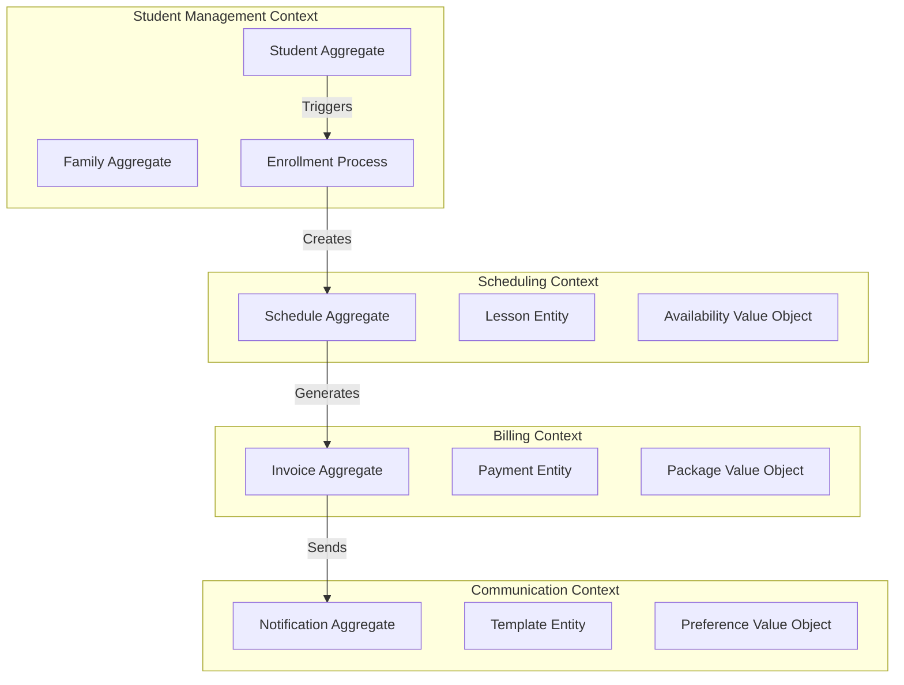
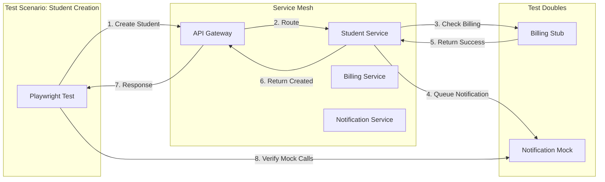
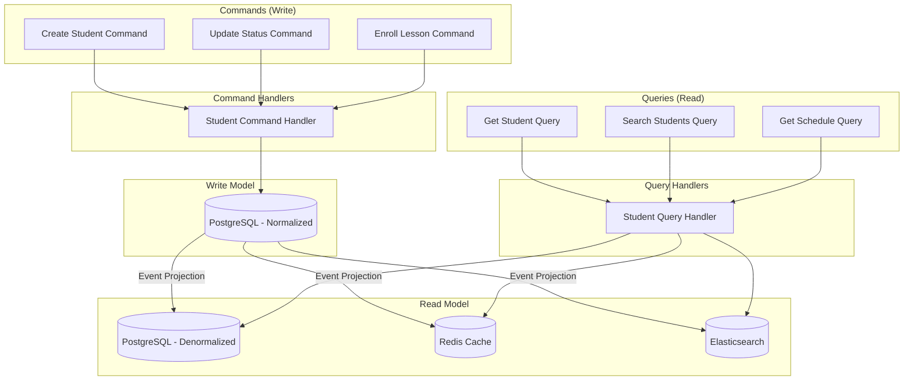
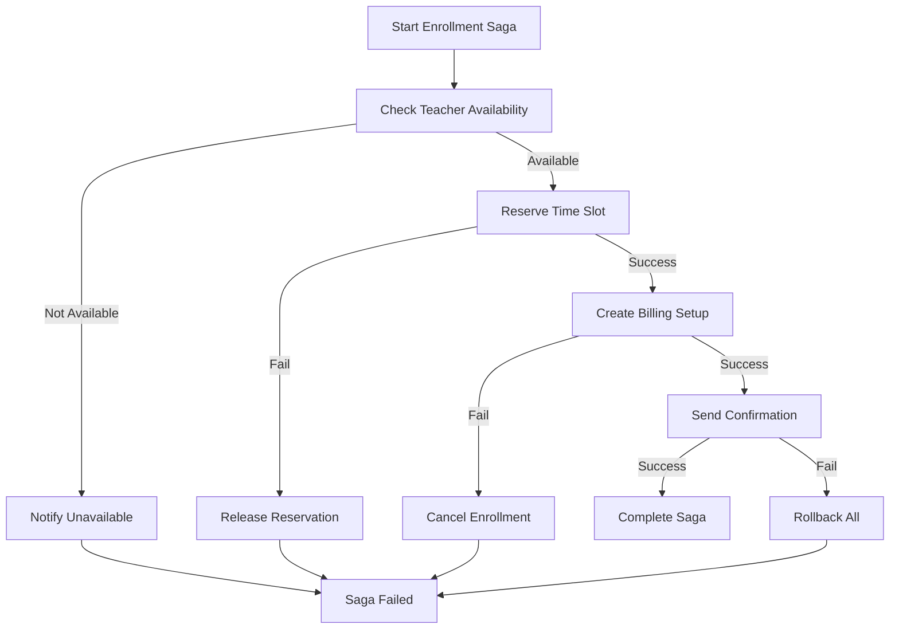
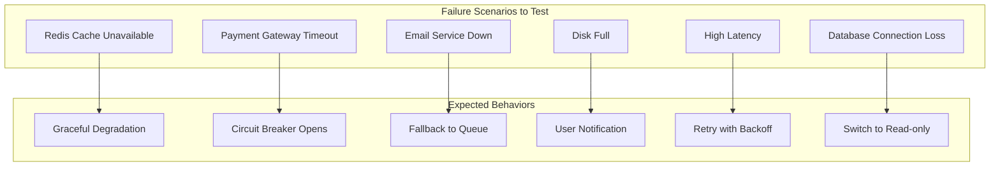
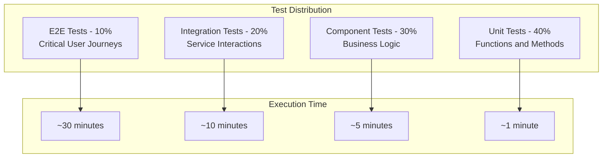

# Enterprise Testing Patterns for MyMusicStaff

## Architectural Testing Considerations

### System Architecture Layers



### Testing at Each Layer

| Layer | Testing Focus | Tools/Approach |
|-------|--------------|----------------|
| UI Layer | User flows, form validation, responsive design | Playwright E2E |
| API Gateway | Authentication, rate limiting, routing | Playwright API + E2E |
| Business Logic | Business rules, data validation, workflows | API tests, Integration tests |
| Data Layer | Data persistence, consistency, performance | Verification queries |
| External Services | Integration reliability, error handling | Mocked responses, contract tests |

## Event-Driven Architecture Patterns

### Student Creation Event Flow



### Testing Event-Driven Systems

```typescript
// Example: Testing eventual consistency
async function testEventualConsistency() {
  // Create student
  const student = await createStudent(testData);

  // Immediate check - should exist in primary DB
  const immediate = await getStudent(student.id);
  expect(immediate).toBeDefined();

  // Wait for eventual consistency
  await waitFor(async () => {
    // Check search index
    const searchResult = await searchStudent(student.email);
    return searchResult.length > 0;
  }, {
    timeout: 5000,
    interval: 500
  });

  // Verify all downstream services
  const billing = await getBillingAccount(student.id);
  expect(billing).toBeDefined();

  const welcomeEmail = await getEmailQueue(student.email);
  expect(welcomeEmail).toContain('Welcome');
}
```

## Domain-Driven Design Patterns

### Bounded Contexts in Music School Domain



### Aggregate Testing Strategies

```typescript
// Testing Student Aggregate invariants
describe('Student Aggregate', () => {
  test('should enforce business invariants', async () => {
    const student = new Student();

    // Invariant: Child must have parent
    expect(() => {
      student.setType('Child');
      student.save();
    }).toThrow('Child student requires parent information');

    // Invariant: Cannot have duplicate active enrollments
    student.addEnrollment({ instrument: 'Piano', teacher: 'Smith' });
    expect(() => {
      student.addEnrollment({ instrument: 'Piano', teacher: 'Smith' });
    }).toThrow('Student already enrolled in Piano with Smith');

    // Invariant: Status transitions must be valid
    student.setStatus('Trial');
    expect(() => {
      student.setStatus('Graduated');
    }).toThrow('Cannot transition from Trial to Graduated');
  });
});
```

## Microservices Testing Patterns

### Service Interaction Testing



### Contract Testing Between Services

```typescript
// Consumer Contract Test (Student Service → Billing Service)
describe('Student Service as Billing Consumer', () => {
  test('should handle billing service contract', async () => {
    const pact = new Pact({
      consumer: 'StudentService',
      provider: 'BillingService'
    });

    await pact.setup();

    // Define expected interaction
    await pact.addInteraction({
      state: 'Billing service is available',
      uponReceiving: 'a request to create billing account',
      withRequest: {
        method: 'POST',
        path: '/billing/accounts',
        body: {
          studentId: like('sdt_12345'),
          type: 'student',
          billingCycle: 'monthly'
        }
      },
      willRespondWith: {
        status: 201,
        body: {
          accountId: like('acc_67890'),
          status: 'active'
        }
      }
    });

    // Test the interaction
    const result = await studentService.createBillingAccount('sdt_12345');
    expect(result.accountId).toBeDefined();

    await pact.verify();
  });
});
```

## CQRS Pattern Implementation

### Command vs Query Separation



### Testing CQRS Patterns

```typescript
// Testing Command Side
describe('Student Commands', () => {
  test('CreateStudent command should emit event', async () => {
    const command = new CreateStudentCommand({
      firstName: 'John',
      lastName: 'Doe',
      email: 'john@test.com'
    });

    const events = await commandHandler.handle(command);

    expect(events).toContainEqual(
      expect.objectContaining({
        type: 'StudentCreated',
        aggregateId: expect.stringMatching(/^sdt_/),
        data: expect.objectContaining({
          firstName: 'John'
        })
      })
    );
  });
});

// Testing Query Side
describe('Student Queries', () => {
  test('should return denormalized view', async () => {
    // Given: Student exists in write model
    await createStudent({ id: 'sdt_123' });

    // When: Query read model
    const query = new GetStudentQuery('sdt_123');
    const result = await queryHandler.handle(query);

    // Then: Should return enriched view
    expect(result).toMatchObject({
      id: 'sdt_123',
      lessonCount: 0,
      upcomingLessons: [],
      lastActivity: expect.any(Date),
      familyMembers: []
    });
  });
});
```

## Saga Pattern for Distributed Transactions

### Student Enrollment Saga



### Testing Saga Compensations

```typescript
describe('Enrollment Saga', () => {
  test('should compensate on billing failure', async () => {
    // Arrange: Force billing service to fail
    mockBillingService.createAccount.mockRejectedValue(new Error('Payment method invalid'));

    // Act: Start enrollment saga
    const saga = new EnrollmentSaga();
    const result = await saga.execute({
      studentId: 'sdt_123',
      teacherId: 'tch_456',
      timeSlot: 'Monday 3pm'
    });

    // Assert: Compensation occurred
    expect(result.status).toBe('compensated');
    expect(mockScheduleService.releaseSlot).toHaveBeenCalledWith('Monday 3pm');
    expect(mockNotificationService.send).toHaveBeenCalledWith(
      expect.objectContaining({
        type: 'EnrollmentFailed',
        reason: 'Payment setup failed'
      })
    );
  });
});
```

## Performance Testing Patterns

### Load Testing Student Creation

```typescript
// k6 Performance Test Script
import http from 'k6/http';
import { check, sleep } from 'k6';
import { Rate } from 'k6/metrics';

export let errorRate = new Rate('errors');

export let options = {
  stages: [
    { duration: '2m', target: 10 },  // Ramp up to 10 users
    { duration: '5m', target: 10 },  // Stay at 10 users
    { duration: '2m', target: 50 },  // Ramp up to 50 users
    { duration: '5m', target: 50 },  // Stay at 50 users
    { duration: '2m', target: 0 },   // Ramp down to 0
  ],
  thresholds: {
    'http_req_duration': ['p(95)<5000'], // 95% of requests under 5s
    'errors': ['rate<0.1'],              // Error rate under 10%
  },
};

export default function() {
  const payload = JSON.stringify({
    firstName: `LoadTest${Date.now()}`,
    lastName: 'Student',
    email: `test${Date.now()}@load.com`,
    type: 'Adult',
    status: 'Active'
  });

  const params = {
    headers: {
      'Content-Type': 'application/json',
      'Authorization': 'Bearer ' + __ENV.API_TOKEN,
    },
  };

  const response = http.post('https://app.mymusicstaff.com/api/students', payload, params);

  const success = check(response, {
    'status is 201': (r) => r.status === 201,
    'response time < 5s': (r) => r.timings.duration < 5000,
    'student id returned': (r) => JSON.parse(r.body).id !== undefined,
  });

  errorRate.add(!success);
  sleep(1);
}
```

## Chaos Engineering Considerations

### Failure Injection Points



### Resilience Testing Example

```typescript
describe('System Resilience', () => {
  test('should handle payment service failure gracefully', async ({ page }) => {
    // Inject failure
    await page.route('**/api/billing/**', route => {
      route.abort('failed');
    });

    // Attempt student creation
    await createStudentFlow(page, testData);

    // Should show appropriate error
    await expect(page.locator('.alert-warning'))
      .toContainText('Billing setup unavailable. Student created but requires manual billing setup.');

    // Student should still be created
    await page.goto('/students');
    await expect(page.locator(`text=${testData.name}`)).toBeVisible();

    // Should be marked for manual processing
    await expect(page.locator('.billing-pending-badge')).toBeVisible();
  });
});
```

## Security Testing Patterns

### OWASP Top 10 Considerations

| Vulnerability | Test Scenario | Expected Result |
|--------------|--------------|-----------------|
| SQL Injection | Input: `'; DROP TABLE students; --` | Input sanitized, no DB impact |
| XSS | Input: `<script>alert('XSS')</script>` | HTML encoded on display |
| CSRF | Submit without CSRF token | Request rejected |
| Broken Auth | Access with expired token | 401 Unauthorized |
| Sensitive Data | Check response payloads | No passwords, tokens exposed |
| XXE | Upload malicious XML | XML parsing disabled |
| Broken Access | Student A access Student B | 403 Forbidden |
| Security Misconfig | Check error messages | No stack traces exposed |
| Vulnerable Components | Check dependencies | All updated, no CVEs |
| Insufficient Logging | Perform suspicious actions | All logged with context |

## Test Strategy for Complex Systems

### Testing Pyramid for Enterprise Systems



### Risk-Based Test Selection

```typescript
// Test prioritization based on risk score
const testPriorities = {
  'student-creation': {
    businessImpact: 10,  // Revenue critical
    probability: 8,       // Used daily
    riskScore: 80,       // High priority
    coverage: 'comprehensive'
  },
  'report-generation': {
    businessImpact: 5,   // Nice to have
    probability: 3,       // Used monthly
    riskScore: 15,       // Low priority
    coverage: 'basic'
  }
};

// Dynamic test selection based on risk
function selectTests(timeAvailable: number) {
  const sorted = Object.entries(testPriorities)
    .sort((a, b) => b[1].riskScore - a[1].riskScore);

  const selected = [];
  let timeUsed = 0;

  for (const [test, meta] of sorted) {
    const testTime = getTestDuration(test);
    if (timeUsed + testTime <= timeAvailable) {
      selected.push(test);
      timeUsed += testTime;
    }
  }

  return selected;
}
```

## Key Takeaways for Candidates

1. **Think in Systems**: Consider the entire ecosystem, not just the UI
2. **Embrace Complexity**: Real systems have intricate business rules
3. **Plan for Failure**: Test resilience and recovery scenarios
4. **Consider Scale**: Your tests should work for 10 or 10,000 students
5. **Business First**: Technical patterns serve business needs
6. **Maintainability Matters**: Complex tests need clear structure

Your automation should demonstrate understanding of these enterprise patterns while remaining practical and maintainable.