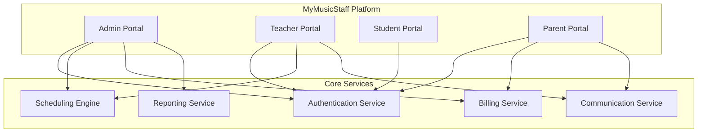
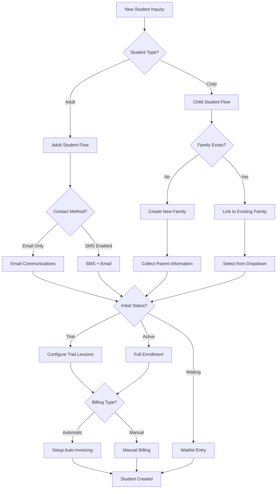
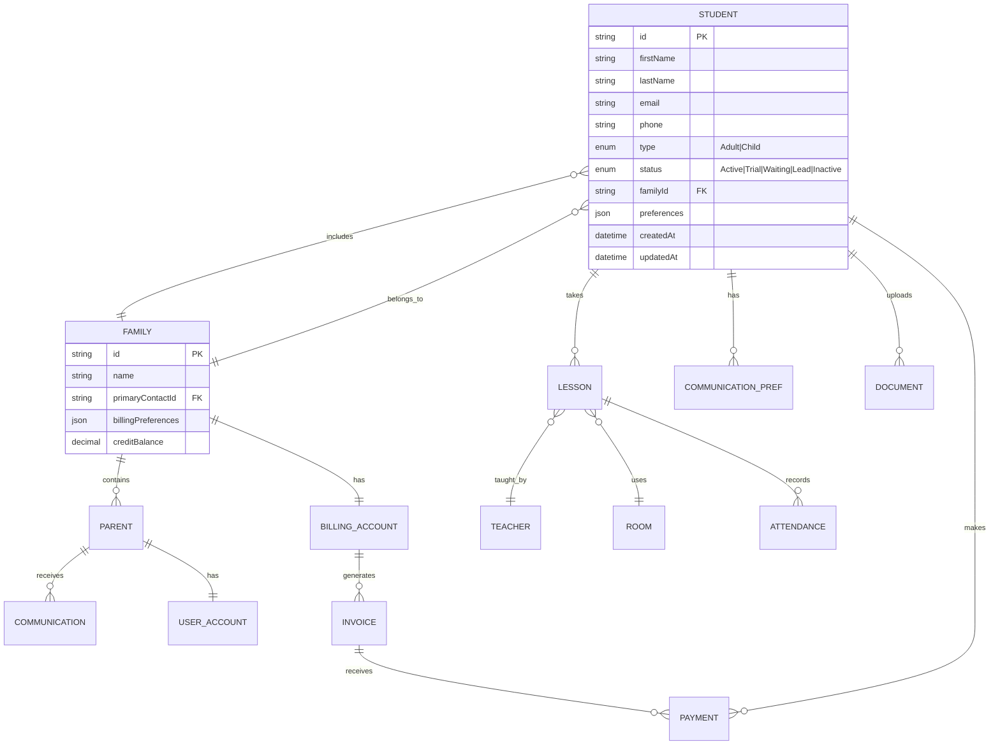
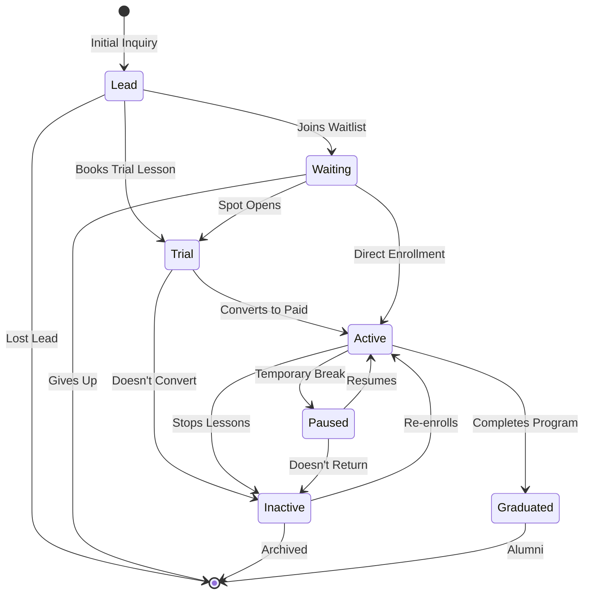
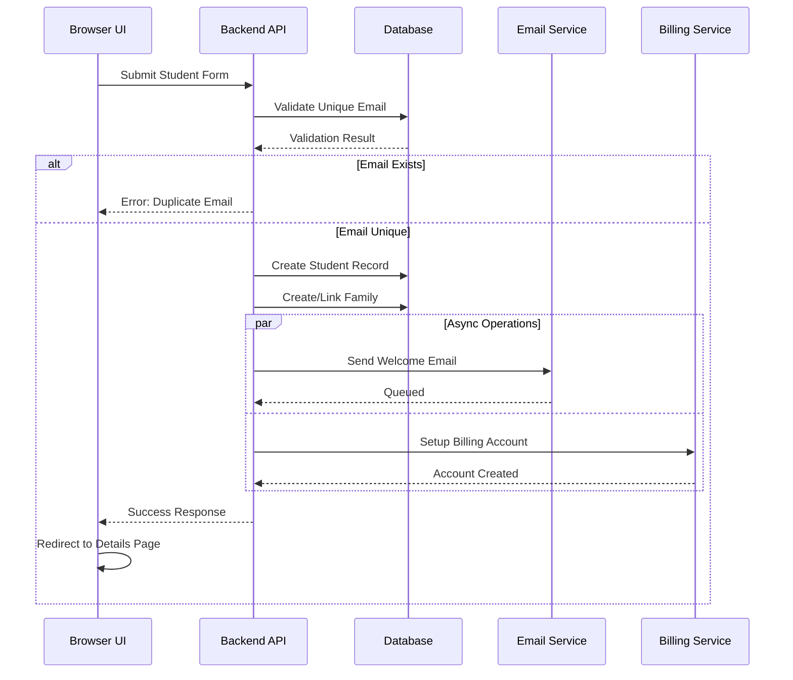
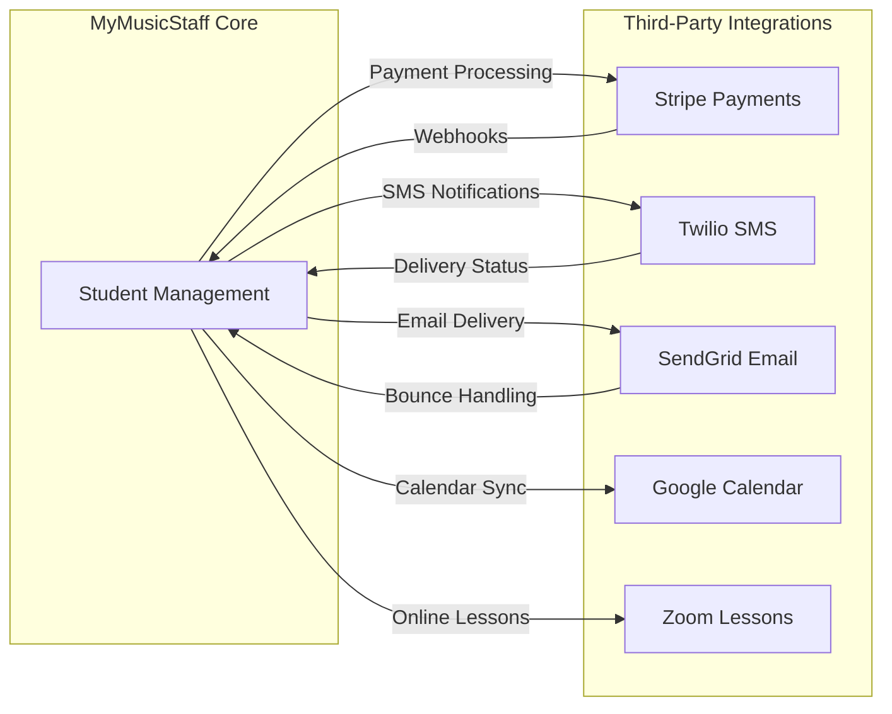
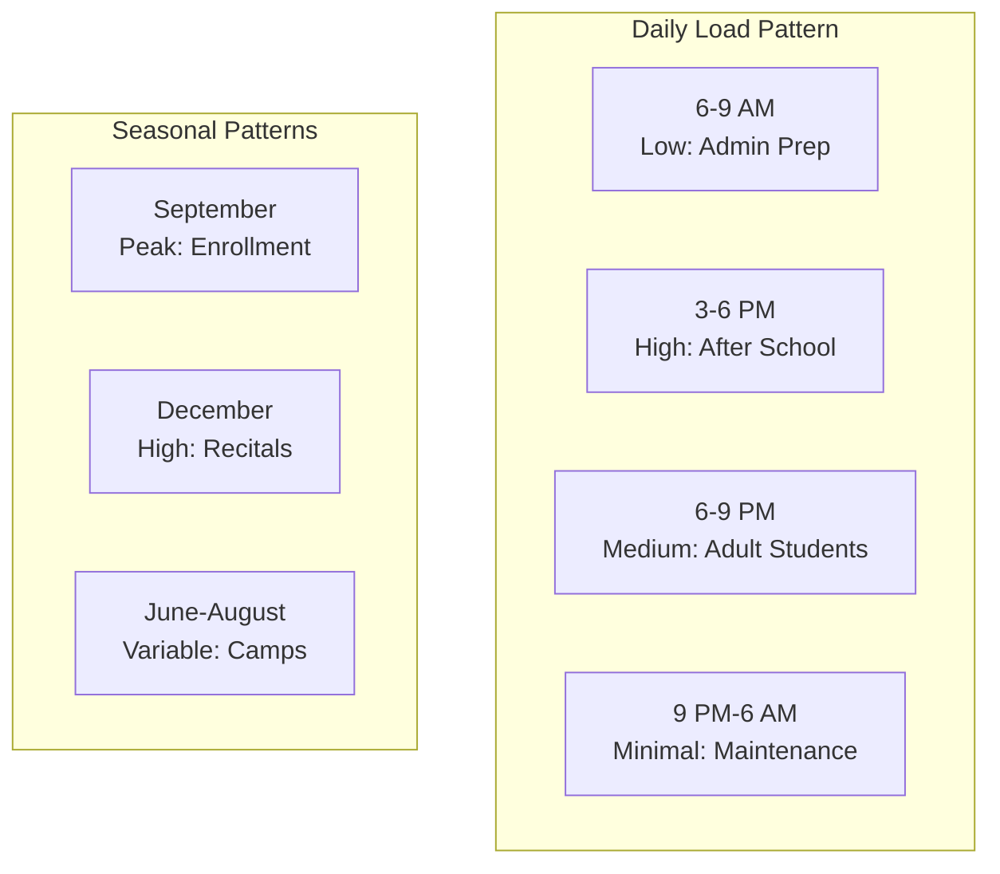

# MyMusicStaff Platform Overview - Understanding the Business Domain

## Why Music School Management Systems Matter

### The Music Education Industry Challenge

Music schools face unique operational challenges that generic scheduling or CRM systems cannot address:

1. **Complex Scheduling Requirements**
   - Teachers with varying availability across multiple locations
   - Students needing consistent weekly slots
   - Makeup lessons that must be scheduled within policy windows
   - Room and instrument availability constraints
   - Recital and group class scheduling

2. **Multi-Stakeholder Communication**
   - Parents (decision makers and payers)
   - Students (service receivers)
   - Teachers (service providers)
   - School administrators
   - Each requiring different information and access levels

3. **Specialized Billing Scenarios**
   - Monthly tuition vs. per-lesson billing
   - Package deals and family discounts
   - Teacher commission calculations
   - Makeup lesson credits
   - Trial lesson conversions

4. **Educational Progress Tracking**
   - Repertoire management
   - Practice logs
   - Skill progression
   - Recital participation
   - Exam preparation

## MyMusicStaff Platform Architecture

### Platform URL Structure

**Main Application**: https://app.mymusicstaff.com

**Key URLs for Testing**:
- Login: `/login`
- Teacher Dashboard: `/Teacher/v2/en/dashboard`
- Students Section: `/Teacher/v2/en/students`
- Add Student: `/Teacher/v2/en/students/add`
- Student Details: `/Teacher/v2/en/students/details?id={student_id}`
- Schedule: `/Teacher/v2/en/schedule`
- Billing: `/Teacher/v2/en/billing`

### Multi-Portal Architecture

## Student Onboarding - The Critical Business Flow

### Why Student Onboarding is Business-Critical

1. **First Impression**: Sets the tone for the entire customer relationship
2. **Data Accuracy**: Errors here cascade through billing, communication, and scheduling
3. **Conversion Point**: Where trials become paying customers
4. **Compliance**: COPPA and FERPA requirements for minors
5. **Revenue Impact**: Directly affects Monthly Recurring Revenue (MRR)

### Business Complexity in Student Onboarding

#### The Multi-Step Decision Tree

### Data Model Complexity

#### Student Entity Relationships

### State Transitions in Student Lifecycle

## Testing Complexity - What Makes This Challenging

### 1. Business Rule Validation Complexity

#### Email/SMS Logic Truth Table

| SMS Capable | Email Provided | Phone Provided | Valid? | Required Fields |
|-------------|---------------|----------------|---------|-----------------|
| Yes | Yes | Yes | ✅ | None |
| Yes | No | Yes | ✅ | None |
| Yes | Yes | No | ❌ | Phone Required |
| No | Yes | Yes | ✅ | None |
| No | Yes | No | ✅ | None |
| No | No | Yes | ❌ | Email Required |
| No | No | No | ❌ | Email Required |

### 2. Multi-Step Form Complexity

The student onboarding is a wizard-style multi-step form:

**Step 1: Student Information**
- Basic details
- Type selection (triggers conditional fields)
- Communication preferences
- Initial status

**Step 2: Billing Setup**
- Automatic vs Manual
- Payment schedule
- Package selection
- Discount application

Each step maintains state, and back navigation must preserve entered data.

### 3. Asynchronous Operations

### 4. Data Consistency Requirements

The system must maintain consistency across:
- **Immediate Consistency**: Student appears in list immediately after creation
- **Eventual Consistency**: Search index updates within 5 seconds
- **Cross-Service Consistency**: Billing account matches student status
- **Audit Trail**: All changes logged with timestamps and user

### 5. Edge Cases in Production

Real-world edge cases that occur:

1. **Duplicate Names**: "John Smith" vs "John Smith Jr."
2. **International Names**: "José García-Márquez"
3. **Email Variations**: "parent+child1@email.com"
4. **Phone Formats**: International numbers, extensions
5. **Family Relationships**: Divorced parents, multiple guardians
6. **Status Transitions**: Trial extending beyond limit
7. **Timezone Issues**: Daylight saving time changes
8. **Concurrent Access**: Multiple admins editing same student
9. **Data Migration**: Legacy students without complete data
10. **Payment Edge Cases**: Failed card during trial conversion

## System Integration Points

### External System Dependencies

## Performance Considerations

### Expected Response Times

| Operation | Expected Time | Maximum Time | Business Impact |
|-----------|--------------|--------------|-----------------|
| Form Submission | < 2s | 5s | Conversion Rate |
| Page Load | < 1s | 3s | User Experience |
| Search | < 500ms | 2s | Productivity |
| Bulk Operations | < 5s | 30s | Admin Efficiency |

### Load Patterns

## Security & Compliance Requirements

### COPPA Compliance for Minors
- Parent consent required for children under 13
- Limited data collection
- Special deletion rights
- No behavioral tracking

### FERPA Educational Records
- Student progress data protection
- Parent access rights
- Audit trail requirements
- Data retention policies

### PCI Compliance
- No credit card storage in application
- Tokenization via Stripe
- Secure transmission
- Regular security audits

## Testing Philosophy for Enterprise Systems

### Think Like a Business Owner

When testing this system, consider:

1. **Revenue Impact**: Will this bug affect billing or conversion?
2. **Reputation Risk**: Will this create a poor parent experience?
3. **Operational Efficiency**: Will this slow down daily operations?
4. **Compliance Risk**: Could this violate regulations?
5. **Data Integrity**: Will this corrupt critical business data?

### Think Like an Architect

Consider the system's:

1. **Scalability**: Will this work with 10,000 students?
2. **Maintainability**: Is the test maintainable as the system evolves?
3. **Reliability**: Will the test consistently pass/fail correctly?
4. **Performance**: Does the test complete in reasonable time?
5. **Clarity**: Will other engineers understand the test intent?

### Think Like a User

Remember the different personas:

1. **Busy Parent**: Needs quick, mobile-friendly enrollment
2. **School Admin**: Manages hundreds of students daily
3. **Teacher**: Focuses on teaching, not administration
4. **Student**: May be a child with limited tech skills

## Success Criteria for Test Automation

Your test automation should:

1. **Catch Business-Critical Bugs**: Revenue, compliance, data integrity
2. **Run Reliably**: No flaky tests, consistent results
3. **Provide Clear Feedback**: Obvious what failed and why
4. **Execute Efficiently**: Complete within CI/CD time constraints
5. **Maintain Easily**: Clear structure, good naming, documentation

---

## Key Takeaway

MyMusicStaff is not just a scheduling app—it's a complex business system managing education, finances, and relationships. Your tests should reflect this complexity while remaining maintainable and reliable. Focus on business value, not technical implementation details.